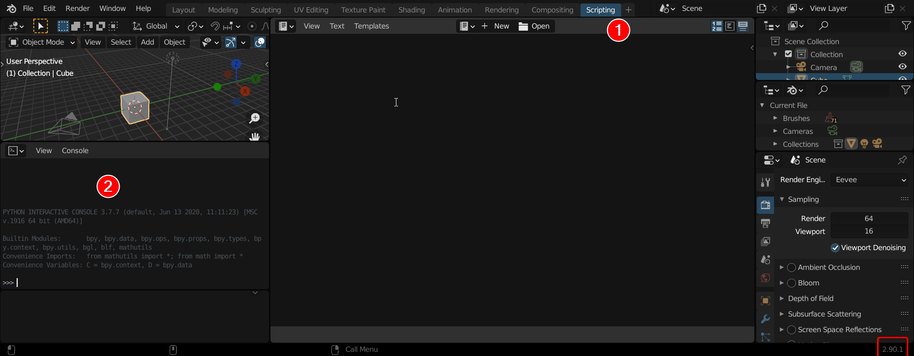
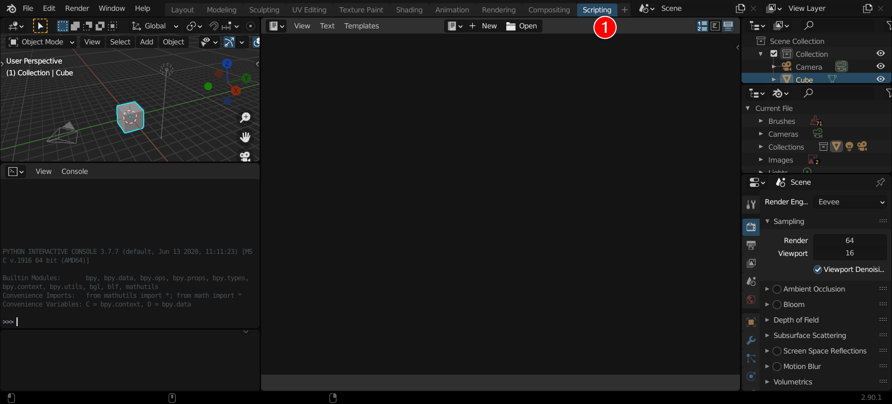
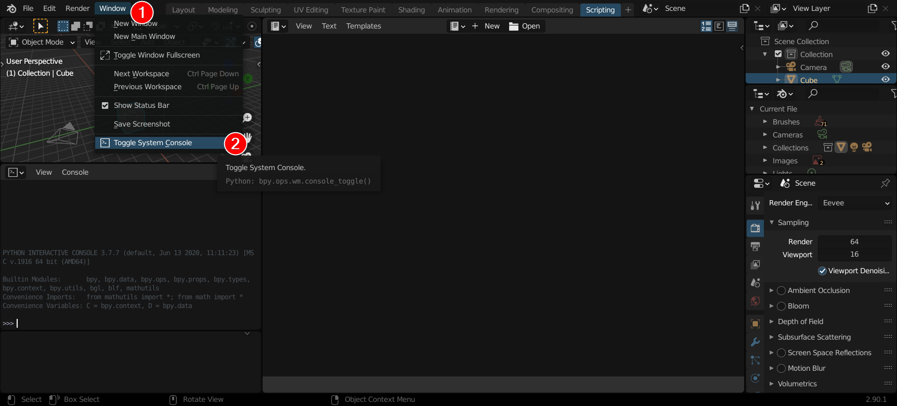
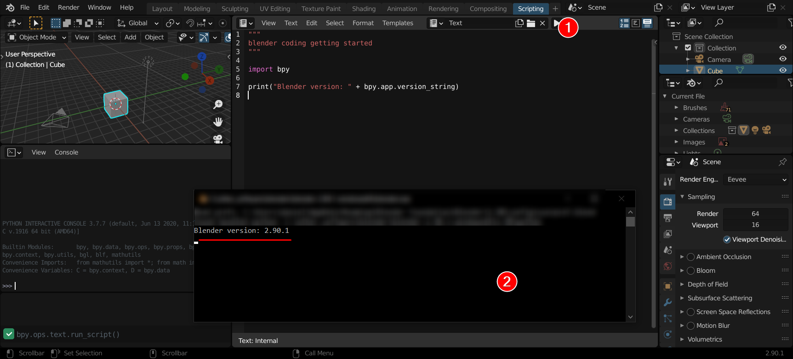

This is a getting started step by step instruction to use Visual Studio Code for Blender python scripting.  
Tested with Blender 2.90.1 on Windows 10-64bit but should work also with older/newer versions of Blender and other OS like Linux or macOS.

Steps:

1. Install [Blender 2.90.1](https://www.blender.org/)
2. Install [VSCode](https://code.visualstudio.com/)
3. Install [Python](https://www.python.org/) (same version which is used within Blender: 2.90.1 uses Python 3.7.7)
   - to check which version of Python is used within Blender: just open Blender and switch to the "scripting" view and read the Python version:
     
4. Create a folder for you scripting project
5. Install and setup [VSCode Python Extension](https://marketplace.visualstudio.com/items?itemName=ms-python.python)

   1. Select Python interpreter: CTRL+SHIFT+P -> Python: Select Interpreter
      - select the interpreter from installed Python
   2. Select Python Linter: CTRL+SHIFT+P -> Python: Select Linter
      - select pylint and probably install it

6. Install and setup [VSCode Python Langage Server](https://marketplace.visualstudio.com/items?itemName=ms-python.vscode-pylance)

   1. Configure in your settings:

   ```JSON
   "python.languageServer": "Pylance"
   ```

7. Test Python extension

   1. Create new file called "hello_world.py" and paste this code into it:

   ```python
   """
   hello world test script to check if VSCode Python extension is working
   """

   import sys

   MSG = "Hello World!\n"
   print(MSG)
   print("Python version: " + sys.version)
   ```

   2. Right-click anywhere in the editor window and select Run Python File in Terminal
   3. You should see something like this:

   ```shell
   Hello World!

   Python version: 3.7.7 (tags/v3.7.7:d7c567b08f, Mar 10 2020, 10:41:24) [MSC v.1900 64 bit (AMD64)]
   ```

8. Install and setup Autocomplete modules for Blender python API

   1. Download or clone from <https://github.com/Korchy/blender_autocomplete>
   2. Add to User Settings:

   ```JSON
   "python.autoComplete.extraPaths": [
   "<PATH_TO_BLENDER_AUTOCOMPLETE>/blender_autocomplete/2.90"
   ],
   "python.analysis.extraPaths": [
       "<PATH_TO_BLENDER_AUTOCOMPLETE>/blender_autocomplete/2.90"
   ],
   "python.linting.pylintArgs": [
       "--init-hook",
       "import sys; sys.path.append('<PATH_TO_BLENDER_AUTOCOMPLETE>,/blender_autocomplete/2.90')"
   ],
   ```

9. Test script within Blender

   1. Create a new file in your VSCode workspace called "blender_hello_world.py" and paste the follwing code into it:

      ```python
      """
      blender coding getting started
      """

      import bpy

      print("Blender version: " + bpy.app.version_string)
      ```

   2. Open Blender and switch to scripting:
      
   3. Toggle sytem console:
      
   4. Open your created script and run it, then you should see the console output
      

TODO's

- Remote debugging
