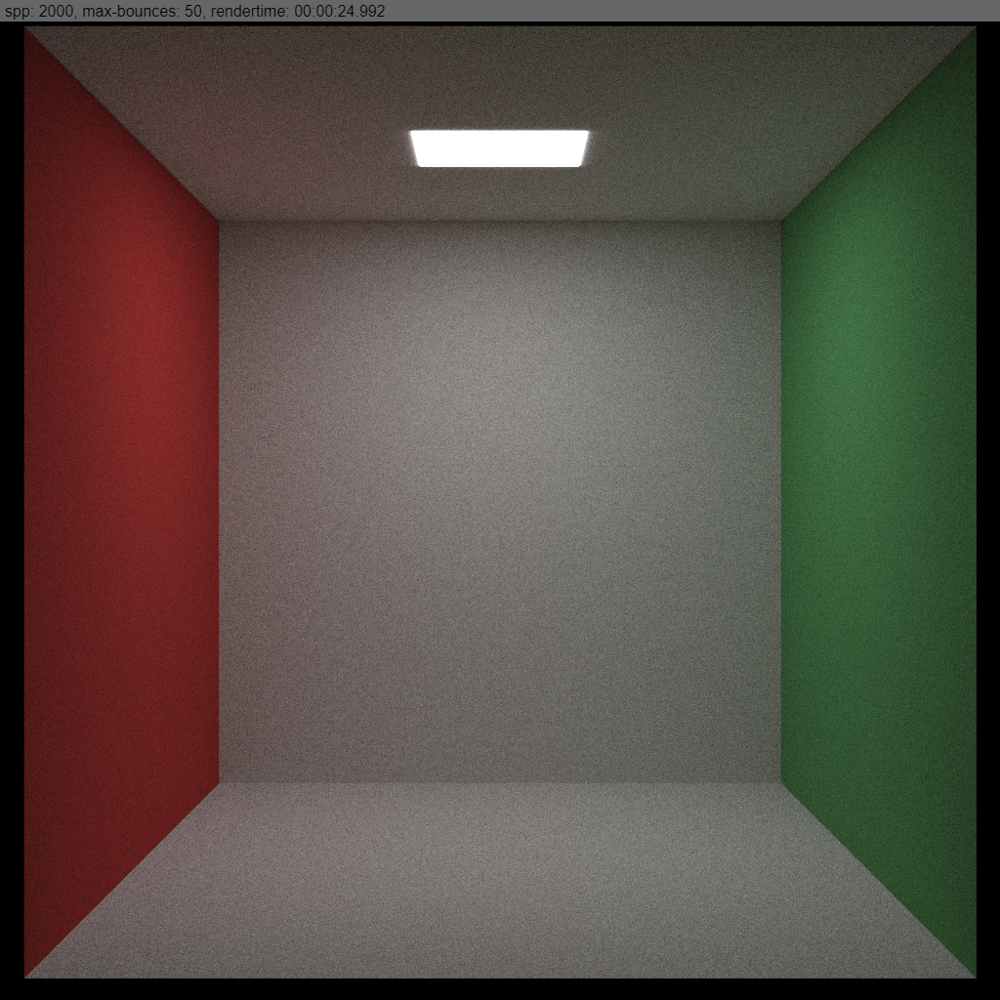

The rect primitive type is now implemented in the WebGPU code of the [TS-Raytracer](/2020-06/ts-raytracer/).  
Now the WebGPU implementation is able to render rects and spheres.

##### Example rendering

