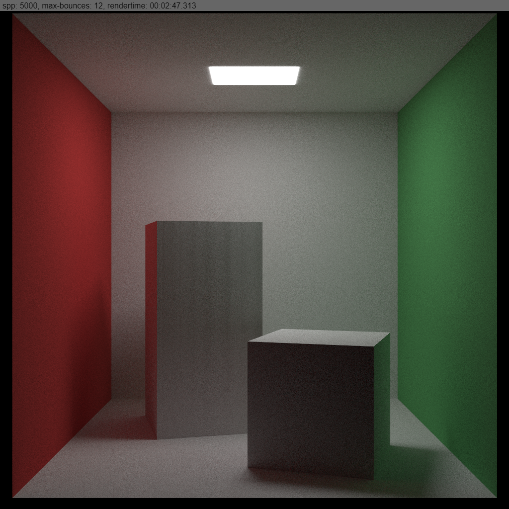

The box primitive type is now implemented in the WebGPU code of the [TS-Raytracer](/2020-06/ts-raytracer/).  
Now the WebGPU implementation is able to render boxes, rects and spheres.  
I have also implemented a better transformation system.

##### Example rendering

