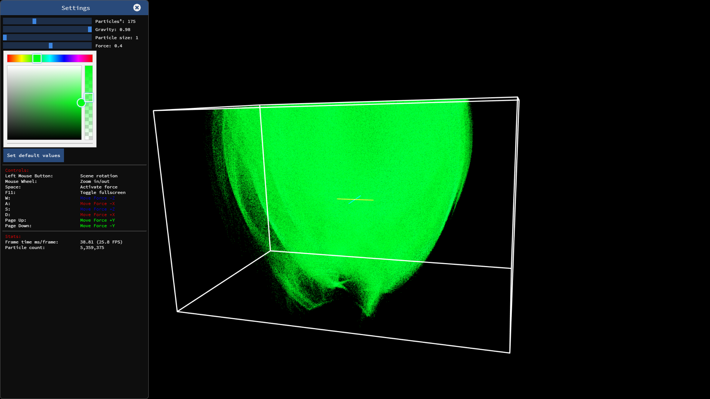

import { FontAwesomeIcon } from '@fortawesome/react-fontawesome';

Particles calculated and rendered with [WebGL 2.0](https://www.khronos.org/registry/webgl/specs/latest/2.0/). The calculation is done by a compute shader.  
WebGL 2.0 is specified against [OpenGL ES 3.0](https://www.khronos.org/registry/OpenGL-Refpages/es3.0/) which does not contain compute shaders.  
Compute shaders where introduced in [Open GL ES 3.1](https://www.khronos.org/registry/OpenGL-Refpages/es3.1/)  
And based on this there, was a proposal developed for [WebGL 2.0 Compute](https://www.khronos.org/registry/webgl/specs/latest/2.0-compute/)

##### Screenshot

If you want to try this out, the current version is published [here](https://hsimpson.github.io/webgpu-particles).

<FontAwesomeIcon icon={['fab', 'chrome']} style={{ marginRight: '5px' }} />

You should use Chrome Dev (Canary no does no longer have this available) and start with some flags: `"[PATH_TO_CHROME_DEV]\chrome.exe" --enable-webgl2-compute-context --use-cmd-decoder=passthrough`

The source code is available on [Github](https://github.com/hsimpson/three_particles) <FontAwesomeIcon icon={['fab', 'github']} />
