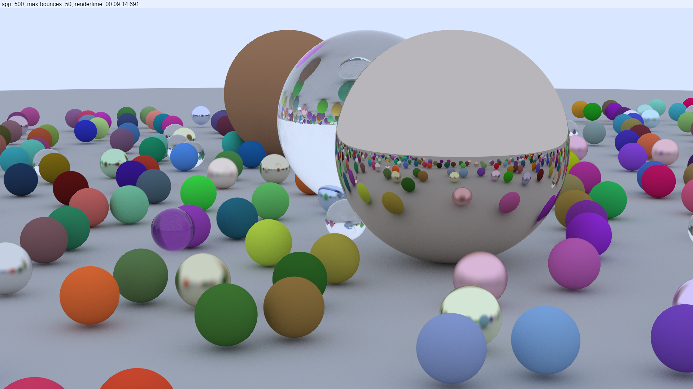

import { FontAwesomeIcon } from '@fortawesome/react-fontawesome';

A Raytracer which runs in the Browser. There are 2 implementations:

1. CPU: which runs totally in JavaScript but with web workers for parallel computing
2. WebGPU compute: only runs when WebGPU is enabled see [Implemenation Status](https://github.com/gpuweb/gpuweb/wiki/Implementation-Status)

Here is an example wich was rendered on GPU (Nvidia GTX 1060) with 500 Spp (Samples per pixel) and 50 bounces, rendertime was 9 min 15 sec

##### Example rendering

If you want to try this out, the current version is published [here](https://hsimpson.github.io/ts-raytracer).

<FontAwesomeIcon icon={['fab', 'chrome']} style={{ marginRight: '5px' }} />
Until WebGPU is official available you should use Chrome Canaray and enable the `enable-unsafe-webgpu flag` via `chrome://flags/#enable-unsafe-webgpu`.

<FontAwesomeIcon icon={['fab', 'firefox-browser']} style={{ marginRight: '5px' }} />
You could also use Firefox Nightly and enable `dom.webgpu.enabled` and `gfx.webrender.all` via `about:config`.

The source code is available on [Github](https://github.com/hsimpson/ts-raytracer) <FontAwesomeIcon icon={['fab', 'github']} />

`video: https://www.youtube.com/watch?v=CAvH899EPoo`
