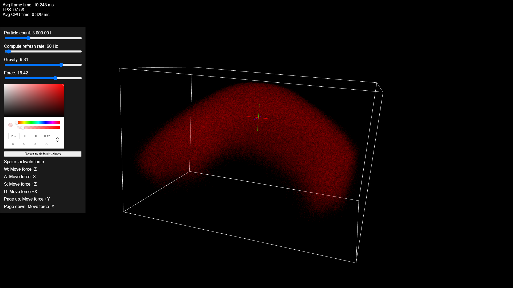

import { FontAwesomeIcon } from '@fortawesome/react-fontawesome';

Particles calculated and rendered with [WebGPU](https://github.com/gpuweb/gpuweb), see [Implemenation Status](https://github.com/gpuweb/gpuweb/wiki/Implementation-Status)

##### Screenshot

If you want to try this out, the current version is published [here](https://hsimpson.github.io/webgpu-particles).

<FontAwesomeIcon icon={['fab', 'chrome']} style={{ marginRight: '5px' }} />

Until WebGPU is official available you should use Chrome Canaray and enable the `enable-unsafe-webgpu flag` via `chrome://flags/#enable-unsafe-webgpu`.

<FontAwesomeIcon icon={['fab', 'firefox-browser']} style={{ marginRight: '5px' }} />

You could also use Firefox Nightly and enable `dom.webgpu.enabled` and `gfx.webrender.all` via `about:config`.

The source code is available on [Github](https://github.com/hsimpson/webgpu-particles) <FontAwesomeIcon icon={['fab', 'github']} />

`video: https://www.youtube.com/watch?v=5RSTBdBZ9m8`
